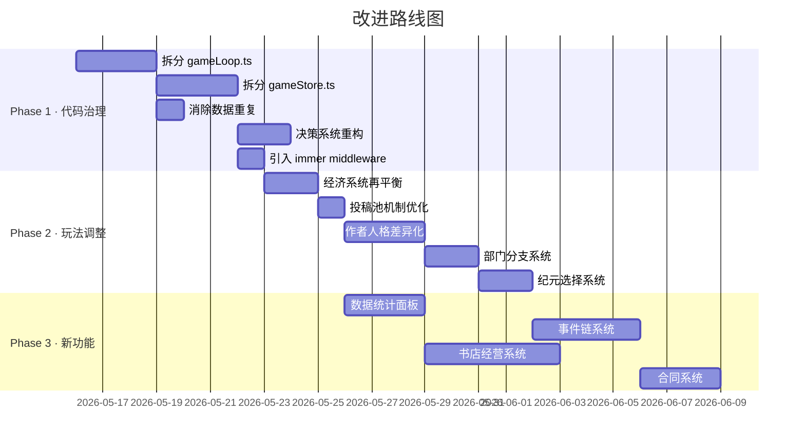

# 永夜出版社 · 项目全面评审与改进方案

> 基于对完整代码库的深度审阅，参考经典挂机游戏（Cookie Clicker、Idle Slayer、Melvor Idle）与经营类游戏（Game Dev Tycoon、开罗系列、文学少女）的设计范式，提出以下三大维度的分析。

---

## 一、现有玩法调整建议（Balance & Feel）

### 1.1 经济系统节奏失衡

当前三种货币（RP / 声望 / 版税）的获取与消耗存在明显的**中期断层**：

| 问题 | 现状 | 建议 |
|------|------|------|
| RP 获取过快 | 审稿 5 + 编辑 3 + 校对 2 + 出版 50+，流水线全开后 RP 溢出 | 引入**RP 衰减**机制：单次出版 RP 随当月已出版数递减（第1本100%→第10本50%）；或增加 RP 消耗点（员工薪资、设备维护） |
| 声望缺乏消耗 | 声望主要用于解锁偏好槽（阈值 50/200/800/2000），中间大段空白 | 增加声望消耗项：**赞助文学奖**（已有但触发条件苛刻）、**行业广告投放**、**出版社装修**等 |
| 版税用途单一 | 仅用于加急征稿(100)、领养猫(300)、公关(200)、装修阅览室(500)、赞助奖(1000) | 增加版税 sink：**雇佣助理编辑**（自动精校）、**购买稀有稿纸**（提升来稿品质上限）、**开设书店**（被动收入） |

### 1.2 投稿池机制可优化

- **问题**：投稿池上限 7 + 10分钟过期，在自动审稿开启后投稿池几乎永远清空，玩家失去"判断取舍"的核心体验
- **建议**：
  - 自动审稿改为**只处理品质 ≥ 门槛的稿件**，低品质仍需手动决策
  - 增加**"优先审稿队列"**：玩家可以标记特定作者/类型为优先，自动审稿优先处理
  - 投稿过期时间从固定 600 ticks 改为**动态**：好稿等更久（品质×10 ticks），烂稿更快消失

### 1.3 作者系统深度不足

- **问题**：17 种人格在机制上几乎无差异，只影响名字/签名语/类型偏好。好感度到 100 即重置，缺乏长线目标
- **建议**：
  - 每种人格增加**独特被动效果**（如：焦虑新人投稿后有 20% 概率自动退稿求安慰；韩国网文女王连续出版 3 本后品质 -10 但版税 ×2）
  - 好感度 100 不再重置，改为**解锁专属剧情/稀有稿件/联名出版**
  - 增加**作者关系网**：两位高好感作者可以"合著"，产出更高品质混合类型稿件

### 1.4 部门升级缺乏策略性

- **问题**：4 个部门升级路径线性（花钱→等→升级→花更多钱），缺乏选择
- **建议**：
  - 每个部门在 Lv.3 / Lv.6 / Lv.9 增加**分支选择**（类似天赋树），例如：
    - 编辑部 Lv.3：选"批量审稿"（同时审 2 本）或"精细审稿"（审稿品质 +5）
    - 市场部 Lv.6：选"社交媒体营销"（轻小说销量 ×1.5）或"学术推广"（社科声望 ×2）
  - 部门之间增加**协同效果**：编辑部+设计部同时 Lv.5 → 解锁"精装出版"（品质+10、售价×2）

### 1.5 纪元（转生）收益感弱

- **问题**：每次纪元加成固定（品质+2、速度+5%、版税+10%...），缺乏选择感
- **建议**：
  - 纪元时提供**3 选 1 加成**（参考 Idle Slayer 的升天系统）：
    - "学者之路"：品质+5，编辑速度+10%
    - "商人之路"：版税×1.3，作者投稿速度+20%
    - "名流之路"：声望×1.5，畅销书阈值-20%
  - 增加**纪元专属解锁内容**：第 2 次解锁"夜间模式"（纯文字界面，效率×2）；第 4 次解锁"时间加速"

---

## 二、新增功能建议

### 2.1 🏪 书店经营系统（高优先级）

> 参考：Game Dev Tycoon 的发行系统、开罗《书店日记》

当前出版后书籍只是被动产生版税和销量。建议增加**书店前台**：

- 玩家可以开设 1-3 家书店（版税购买）
- 每家书店有**货架位**（初始 6 个），需要手动/自动上架已出版书籍
- 书店有**客流量**（受地段、装修、声望影响），客流 × 上架书品质 = 实际销量
- 书店可以举办**签售会**（消耗作者好感，短期销量暴增）
- 解锁条件：声望 ≥ 200 或第 2 次纪元

### 2.2 📊 数据统计面板（高优先级）

> 参考：Melvor Idle 的统计页、Cookie Clicker 的 Stats

当前缺少全局数据概览。建议新增"档案室"标签页：

- **出版统计**：总出版数、各类型占比饼图、月出版趋势折线图
- **作者档案**：历史签约/解约/被挖走数量、最高好感作者、最多产作者
- **经济报表**：RP/声望/版税的历史曲线、收支明细
- **成就系统**：独立于收藏的成就列表（首次退稿、首次畅销、10 次纪元…）
- 用简单的 CSS 绘制图表，不需要外部图表库

### 2.3 📜 合同与版权系统（中优先级）

> 参考：Football Manager 的合同系统

- 签约作者时可以设定**合同条款**：
  - 版税分成比例（高分成 = 作者好感高，但版税收入低）
  - 独占期（独占期内作者不会被挖走，但好感每月 -1）
  - 最低出版保证（承诺每年出版 N 本，违约扣声望）
- 合同到期后需要**续约谈判**，好感度影响续约条件

### 2.4 🎪 事件链系统（中优先级）

> 参考：Stellaris 的事件链、Reigns 的连锁决策

当前的 Decision 系统是单次独立事件。建议增加**多步骤事件链**：

- 例："神秘手稿"事件链（3-5 步）：
  1. 收到一份匿名手稿，品质极高但无署名 → 选择调查/直接出版
  2. 若调查 → 发现作者是竞争出版社的知名作家 → 选择保密/公开
  3. 保密 → 作者感激，成为隐藏签约作者（高品质低产量）
  4. 公开 → 引发行业震动，声望暴增但得罪竞争对手
- 事件链的选择影响后续分支，增加重玩价值

### 2.5 🏆 排行榜与赛季系统（低优先级）

> 参考：挂机游戏常见的赛季 reset

- 利用已有的 Cloudflare KV 存储，实现简单的**匿名排行榜**：
  - 本月出版数、总畅销书数、纪元次数
  - 不需要账号系统，用 cloudSaveCode 作为标识
- **赛季模式**：每月/每季重置排行，保留永久成就

### 2.6 🐱 猫系统扩展（低优先级）

- 允许同时养**多只猫**（上限 3），每只有不同性格
- 猫可以"帮忙审稿"：随机标记一本稿件为"猫推荐"（品质可能 ±5）
- 猫的永生后增加**专属事件**（猫与伯爵的互动、猫发现密室等）

### 2.7 💬 作者对话系统（低优先级）

> 参考：模拟经营游戏中的 NPC 对话

- 在作者详情页增加**对话按钮**，调用 LLM 生成基于作者人格的短对话
- 对话选项影响好感度和下本书品质
- 每位作者有**对话记忆**（存储最近 5 次对话摘要，影响后续对话内容）

---

## 三、代码结构问题与改进方案

### 3.1 🔴 巨型文件问题（严重）

| 文件 | 行数 | 问题 |
|------|------|------|
| [gameLoop.ts](file:///d:/fukki/idleditor/src/core/gameLoop.ts) | **1281 行** | 包含 tick 逻辑、稿件创建、作者创建、随机事件、离线进度、编辑批语 —— 职责过多 |
| [gameStore.ts](file:///d:/fukki/idleditor/src/store/gameStore.ts) | **1691 行** | 包含所有 state + 所有 actions + 决策效果应用 + LLM 调用 + 云存储 |
| [synopsis.ts](file:///d:/fukki/idleditor/src/core/humor/synopsis.ts) | **72557 bytes** | 巨大的文本数据文件混在逻辑代码中 |

**改进方案**：

```
src/core/
├── tick/
│   ├── index.ts          # tick() 主函数，只做调度
│   ├── spawnPhase.ts     # 投稿生成逻辑
│   ├── pipelinePhase.ts  # 审稿→编辑→校对→出版流水线
│   ├── economyPhase.ts   # 版税/销量/畅销书计算
│   ├── authorPhase.ts    # 作者冷却/投稿/晋升
│   ├── deptPhase.ts      # 部门升级 tick
│   ├── automationPhase.ts # 自动审稿/封面/退稿
│   └── eventPhase.ts     # 随机事件/里程碑/猫
├── factories/
│   ├── manuscriptFactory.ts  # createManuscript, createManuscriptForAuthor
│   ├── authorFactory.ts      # createRandomAuthor
│   └── coverFactory.ts       # generateCover, generateTitle
├── data/
│   ├── authorNames.ts        # 名字池（从 gameLoop 中提取）
│   ├── authorPhrases.ts      # 签名语池
│   └── editorNotes.ts        # 出版批语模板
└── ...existing files
```

```
src/store/
├── gameStore.ts              # 精简为 state 定义 + 生命周期
├── actions/
│   ├── manuscriptActions.ts  # startReview, reject, shelve, confirmCover...
│   ├── authorActions.ts      # sign, terminate, buyMeal, sendGift...
│   ├── departmentActions.ts  # create, upgrade
│   ├── decisionActions.ts    # resolveDecision, applyDecisionEffect, applyLLMEffects
│   ├── economyActions.ts     # solicit*, reissue, hirePR, renovate...
│   ├── catActions.ts         # adopt, name, pet, makeImmortal, shoo
│   └── cloudActions.ts       # syncToCloud, loadFromCloud
└── selectors.ts              # getSubmittedManuscripts, getPublishedBooks...
```

### 3.2 🔴 State 与 World 重复定义（严重）

`GameWorldState`（gameLoop.ts L86-125）和 `GameStore`（gameStore.ts L141-240）有**大量重复字段**。每次 tick 都需要手动构建 world 对象（gameStore.ts L366-407），然后手动拉回变更（L411-444）。这段 ~80 行的"同步胶水代码"极易出错（漏同步某个字段 = bug）。

**改进方案**：

```typescript
// 方案 A：Store 直接实现 GameWorldState 接口（推荐）
// gameStore 的 state 就是 GameWorldState + UI state
// tick() 直接操作 store state（通过 immer 或 zustand middleware）

// 方案 B：使用 zustand 的 immer middleware
import { immer } from 'zustand/middleware/immer'

const useGameStore = create<GameStore>()(
  immer((set, get) => ({
    tick: () => {
      set(state => {
        // 直接 mutate state，无需手动同步
        tickWorld(state)  
      })
    }
  }))
)
```

### 3.3 🟡 数据与逻辑耦合

作者名字池在 **3 个地方** 重复定义：
1. [constants.ts](file:///d:/fukki/idleditor/src/core/constants.ts) L58-81 — `AUTHOR_PERSONA_NAMES`
2. [gameLoop.ts](file:///d:/fukki/idleditor/src/core/gameLoop.ts) L793-815 — `names` 局部变量（内容相同）
3. `/authors/names.json` — LLM 生成的扩展名字池

签名语也在 [constants.ts](file:///d:/fukki/idleditor/src/core/constants.ts) L164-238 和 [gameLoop.ts](file:///d:/fukki/idleditor/src/core/gameLoop.ts) L817-834 重复。

**改进方案**：统一到 `src/core/data/` 目录，gameLoop 和 constants 都从该目录导入。

### 3.4 🟡 决策系统的标题匹配反模式

[gameStore.ts](file:///d:/fukki/idleditor/src/store/gameStore.ts) 中的 `applyDecisionEffect()` 使用 **字符串标题匹配** 来分发决策效果（L1427-1623）：

```typescript
if (title === '评论家提前审读') { ... }
if (title === '作者请求加急') { ... }
if (title.includes('预支稿费')) { ... }
if (title.includes('想换类型')) { ... }
```

这是脆弱的：标题文案一改，逻辑就断裂。

**改进方案**：

```typescript
// decisions.ts 中每个模板增加 effectId
interface DecisionTemplate {
  effectId: string  // 'critic-preview' | 'rush-publish' | ...
  condition: (state: GameStore) => boolean
  generate: (state: GameStore) => Decision
  apply: (state: GameStore, optionIndex: number) => void  // 效果逻辑内聚
}

// resolveDecision 中直接调用 template.apply()
```

### 3.5 🟡 Map 直接 mutation 后手动触发更新

多处代码直接 mutate Map 中的对象，然后用 `new Map(state.xxx)` 触发 React 重渲染：

```typescript
// gameStore.ts L861-863
ms.status = 'reviewing'
ms.editingProgress = 0
set({ manuscripts: new Map(state.manuscripts) })
```

这种模式有两个问题：
1. **引用透明性差**：直接修改了 state 中的对象，违反 React 不可变更新原则
2. **性能浪费**：每次都创建全新 Map（即使只改了 1 个条目）

**改进方案**：使用 `zustand/middleware/immer` 或手动创建新对象：

```typescript
// 使用 immer（推荐）
set(draft => {
  const ms = draft.manuscripts.get(id)!
  ms.status = 'reviewing'
  ms.editingProgress = 0
})

// 或手动不可变更新
const newMs = { ...ms, status: 'reviewing', editingProgress: 0 }
const newMap = new Map(state.manuscripts)
newMap.set(id, newMs)
set({ manuscripts: newMap })
```

### 3.6 🟡 离线进度的性能问题

[gameLoop.ts](file:///d:/fukki/idleditor/src/core/gameLoop.ts) L1245-1279 的 `computeOfflineProgress` 逐 tick 模拟最多 28800 次（8 小时）。每次 tick 包含大量 Map 遍历和随机事件计算。

**问题**：离开 8 小时后回来，页面可能卡顿数秒（28800 次完整 tick 循环）。

**改进方案**：

```typescript
// 方案 A：抽样模拟（推荐）
// 每 10 ticks 模拟一次，结果乘以 10
const step = Math.max(1, Math.floor(offlineTicks / 2880))
for (let i = 0; i < offlineTicks; i += step) {
  const t = tick(world)
  // accumulate results, multiply by step
}

// 方案 B：公式计算（快速但不精确）
// 直接用公式估算版税、销量、XP，跳过事件系统
function estimateOfflineProgress(world, ticks) {
  const publishedBooks = [...world.manuscripts.values()].filter(m => m.status === 'published')
  const totalRoyalty = publishedBooks.reduce((sum, b) => sum + royaltyPerTick(b, ...) * ticks, 0)
  // ...
}
```

### 3.7 🟢 类型安全可以加强

- `getDeptEfficiency` / `getDeptLevel` 参数是 `string` 而非 `DepartmentType`
- `PERSONA_GENRE_BIAS` 的 key 是 `string` 而非 `AuthorPersona`
- `getCollectionBoost` 中硬编码了 collection id（`'mystery-5'`, `'hybrid-2'`）

### 3.8 🟢 缺少测试覆盖

`src/test/` 目录存在但内容未确认。建议至少覆盖：
- `formulas.ts` — 所有纯函数的单元测试
- `tick()` — 核心 tick 的集成测试（给定初始 world，执行 N ticks，验证状态）
- `leveling.ts` — XP/等级计算
- `calendar.ts` — 日历推进

---

## 优先级路线图



## Open Questions

> [!IMPORTANT]
> 以下问题会影响具体实现方向，请确认：

1. **代码重构优先还是新功能优先？** Phase 1 的代码治理会让后续开发更顺畅，但不产出可见功能。是否接受先花 1 周做重构？
2. **书店系统的复杂度**：是做成简单的"上架 → 被动收入"模式，还是完整的经营模拟（客流、装修、促销）？
3. **是否保留 LLM 依赖？** 当前 Decision 系统优先调用 LLM API 生成事件，回退到模板。如果 LLM API 不稳定，是否考虑去掉 LLM 优先逻辑，改为纯模板 + 偶尔 LLM 润色？
4. **多猫系统**：是否真的需要？会增加 state 复杂度。
5. **目标用户画像**：游戏当前的文字量和文学梗很重，是面向**文学爱好者**还是**泛挂机游戏玩家**？这会影响新功能的设计方向。
